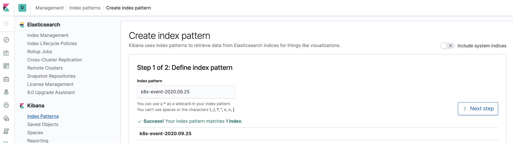
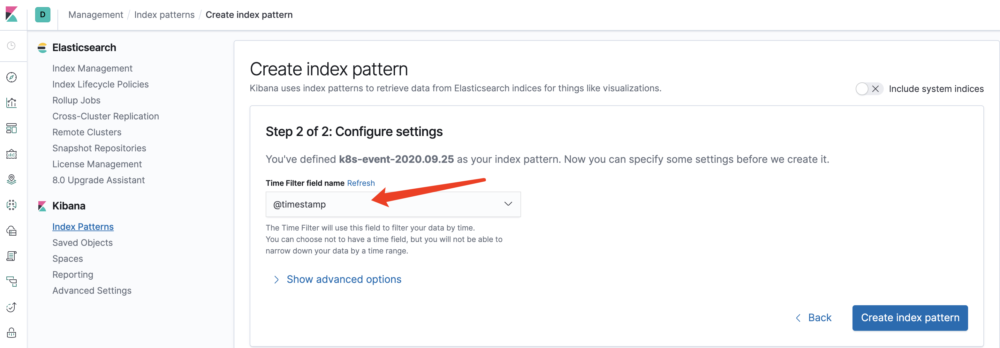
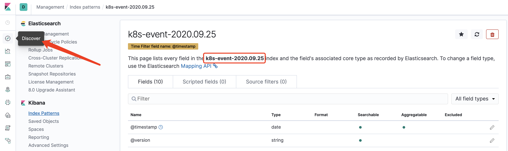
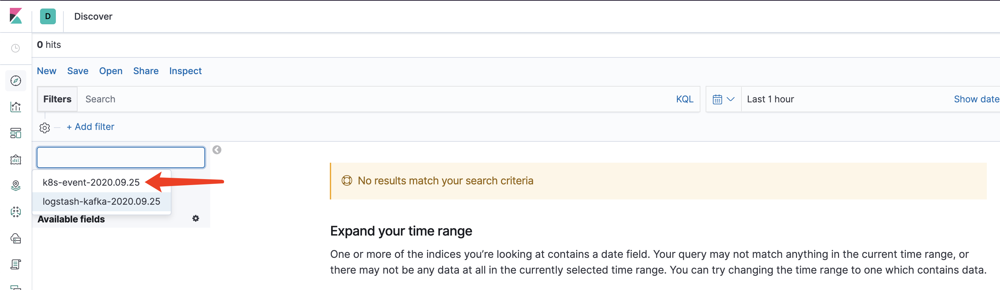
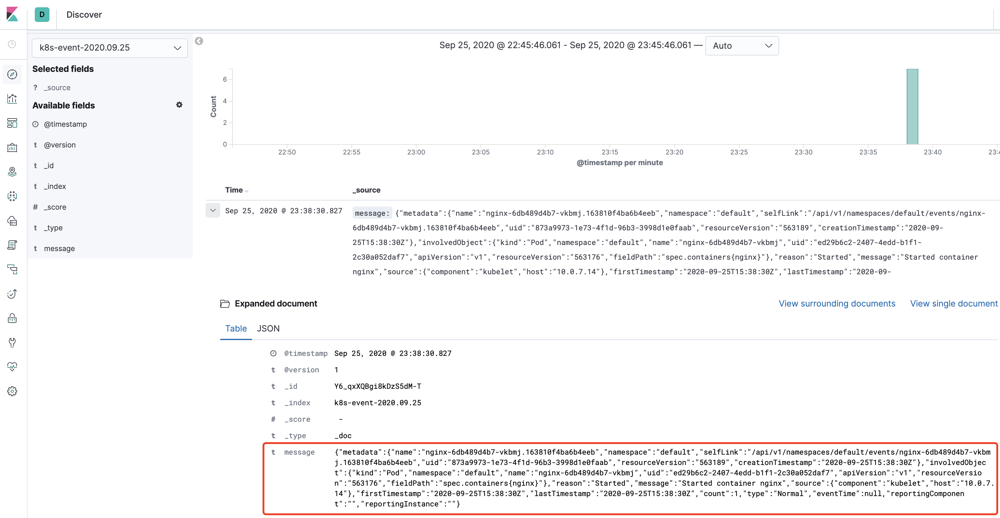

# Event
Event作为 kubernetes的一个对象资源，记录了集群运行所遇到的各种事件,帮助运维同事进行排错，但大量的事件如果都存储在etcd中，会给etcd带来较大的性能与容量压力，所以etcd中默认只保存半小时,而在日常的生产kubernetes环境中，问题的排查过程是需要借助到event所提供的线索，所以就需要借助其他工具进行持久化存储。


#### 部署 kafka
```
docker pull wurstmeister/zookeeper  
docker pull wurstmeister/kafka
docker run -d --name zookeeper -p 2181:2181 -t wurstmeister/zookeeper

docker run  -d --name kafka -p 9092:9092 -e KAFKA_BROKER_ID=0 -e KAFKA_ZOOKEEPER_CONNECT=192.168.1.100:2181 -e KAFKA_ADVERTISED_LISTENERS=PLAINTEXT://192.168.1.100:9092 -e KAFKA_LISTENERS=PLAINTEXT://0.0.0.0:9092 -t wurstmeister/kafka
```

#### 测试 kafka
1. 启动生产者：

```bash
[root@VM-7-14-centos ~]# docker exec -it kafka /bin/bash
bash-4.4# cd /opt/kafka
bash-4.4#  ./bin/kafka-console-producer.sh --broker-list localhost:9092 --topic mykafka
>123123
```
在生产者命令行中输入 123123，然后启动消费者，看是否可以查到该消息。

1. 启动消费者：

```bash
[root@VM-7-14-centos ~]# docker exec -it kafka /bin/bash
bash-4.4# cd /opt/kafka
bash-4.4# ls
LICENSE    NOTICE     bin        config     libs       logs       site-docs
bash-4.4# cd /opt/kafka^C
bash-4.4#    ./bin/kafka-console-consumer.sh --bootstrap-server localhost:9092 --topic mykafka --from-beginning
123123
```
至此，说明 kafka 部署完成；

#### 部署 elasticsearch
```
[root@VM-7-14-centos ~]# docker run --name elasticsearch -p 9200:9200 -p 9300:9300 -e "discovery.type=single-node" -d elasticsearch:7.2.0
验证是否安装成功: 
[root@VM-7-14-centos ~]# curl localhost:9200
{
  "name" : "702355dc4cdd",
  "cluster_name" : "docker-cluster",
  "cluster_uuid" : "wLSMR_3_Q52vJmUdkZQcMw",
  "version" : {
    "number" : "7.2.0",
    "build_flavor" : "default",
    "build_type" : "docker",
    "build_hash" : "508c38a",
    "build_date" : "2019-06-20T15:54:18.811730Z",
    "build_snapshot" : false,
    "lucene_version" : "8.0.0",
    "minimum_wire_compatibility_version" : "6.8.0",
    "minimum_index_compatibility_version" : "6.0.0-beta1"
  },
  "tagline" : "You Know, for Search"
}
```

修改es配置，解决跨域访问的问题：
```bash
[root@VM-7-14-centos ~]# docker exec -it elasticsearch bash
[root@702355dc4cdd elasticsearch]# cd /usr/share/elasticsearch/config/
[root@702355dc4cdd config]# vi elasticsearch.yml 
加入下面两个配置: 
http.cors.enabled: true
http.cors.allow-origin: "*"

[root@702355dc4cdd config]# cat elasticsearch.yml 
cluster.name: "docker-cluster"
network.host: 0.0.0.0
http.cors.enabled: true
http.cors.allow-origin: "*"
```

#### 部署 kibana

```bash
[root@VM-7-14-centos ~]# docker run --name kibana --link=elasticsearch:test -p 5601:5601 -d kibana:7.2.0
```
启动以后，就可以通过浏览器输入 http://ip:5601 ，访问kibana 界面了。

#### 部署logstash

Logstash工作的流程由三部分组成：
```
input：输入（即source），必须要有，指明从那里读取数据。
filter：过滤，logstash对数据的ETL就是在这个里面进行的，这一步可选。
output：输出（即sink），必须要有，指明数据写入到哪里去。
```

所以在我们的场景里面，input就是kafka，output就是es。至于是否需要filter，看你的场景需不需要对input的数据做transform了，本文没有使用filter。input需要使用logstash-input-kafka插件，该插件logstash默认就带了，可以使用bin/logstash-plugin list | grep kafka命令确认。

1. 创建一个的Logstash配置文件 logstash_dev.conf，内容如下：

```
input {
  kafka {
    bootstrap_servers => "localhost:9092"
    topics => ["k8s-event"]
  }
}

output {
  elasticsearch {
    hosts => ["http://localhost:9200"]
    index => "k8s-event-%{+YYYY.MM.dd}"
  }
}
```

1. 运行Logstash

```bash
[root@VM-7-14-centos]# yum install java
[root@VM-7-14-centos]# wget https://artifacts.elastic.co/downloads/logstash/logstash-7.2.0.tar.gz
[root@VM-7-14-centos]# bin/logstash -f logstash_dev.conf
```

#### event-collector 开发和编译
具体代码参见 *.go;

event-collector 编译：
```bash
# CGO_ENABLED=0 GOOS=linux go build -a -installsuffix cgo -o event-collector
```

#### 测试验证

1. 启动 event-collector 程序

```bash
[root@10-0-7-11 ~]# ./event-collector --kubeconfig=/root/.kube/config --topic=k8s-event --broker=10.0.7.14:9092
kafka brokers:  10.0.7.14:9092
```

2. 创建一个nginx的deployment，触发生成 event

```bash
[root@10-0-7-11 ~]# kubectl  run nginx --image=nginx
kubectl run --generator=deployment/apps.v1 is DEPRECATED and will be removed in a future version. Use kubectl run --generator=run-pod/v1 or kubectl create instead.
deployment.apps/nginx created
```

3. 查看 event-collector的标准输出信息,会产生 event日志，类似如下:

```
add:  {{ } {nginx-6db489d4b7-vkbmj.163810f4ba6b4eeb  default /api/v1/namespaces/default/events/nginx-6db489d4b7-vkbmj.163810f4ba6b4eeb 873a9973-1e73-4f1d-96b3-3998d1e0faab 563189 0 2020-09-25 23:38:30 +0800 CST <nil> <nil> map[] map[] [] []  []} {Pod default nginx-6db489d4b7-vkbmj ed29b6c2-2407-4edd-b1f1-2c30a052daf7 v1 563176 spec.containers{nginx}} Started Started container nginx {kubelet 10.0.7.14} 2020-09-25 23:38:30 +0800 CST 2020-09-25 23:38:30 +0800 CST 1 Normal 0001-01-01 00:00:00 +0000 UTC nil  nil  }

send:  {"metadata":{"name":"nginx-6db489d4b7-vkbmj.163810f4ba6b4eeb","namespace":"default","selfLink":"/api/v1/namespaces/default/events/nginx-6db489d4b7-vkbmj.163810f4ba6b4eeb","uid":"873a9973-1e73-4f1d-96b3-3998d1e0faab","resourceVersion":"563189","creationTimestamp":"2020-09-25T15:38:30Z"},"involvedObject":{"kind":"Pod","namespace":"default","name":"nginx-6db489d4b7-vkbmj","uid":"ed29b6c2-2407-4edd-b1f1-2c30a052daf7","apiVersion":"v1","resourceVersion":"563176","fieldPath":"spec.containers{nginx}"},"reason":"Started","message":"Started container nginx","source":{"component":"kubelet","host":"10.0.7.14"},"firstTimestamp":"2020-09-25T15:38:30Z","lastTimestamp":"2020-09-25T15:38:30Z","count":1,"type":"Normal","eventTime":null,"reportingComponent":"","reportingInstance":""}
pid:0 offset:21
```

4. 查看 kibana 控制台，查看是否可以查阅到该event:

4.1 首先根据logstash中的kafka配置信息，查找并创建索引信息

4.2 选择使用时间戳作为filter

4.3 选择 discover 选项，进行查阅索引事件
 
4.4 选择 k8s-event 指定索引

4.5 查询指定 event 信息


#### 参照
https://github.com/heptiolabs/eventrouter
